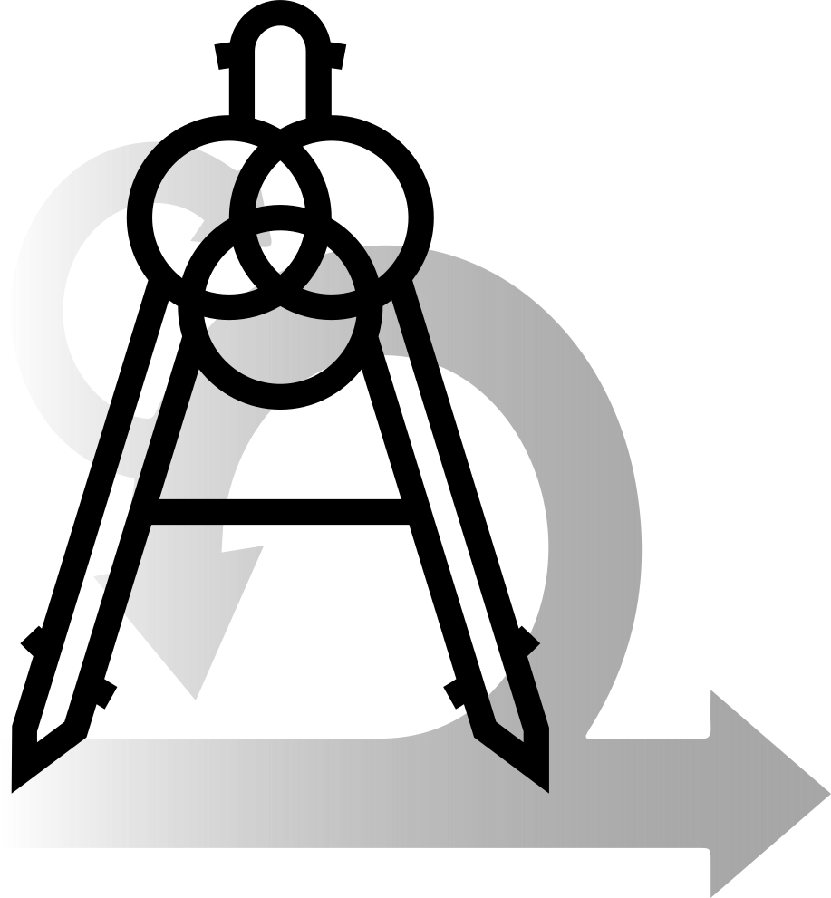

title: Agile Architecture
author: Martin Mauch

%% Build with
%% bundle exec slideshow build index.md -t impress.js --slide

%%%%%
%% Add some inline style rules...

%css

a {
  color: #41a9ff;
  text-decoration: underline;
}

body {
  background-image: -webkit-linear-gradient(top left, black, white);
  background-image:    -moz-linear-gradient(top left, black, white);
  background-image:     -ms-linear-gradient(top left, black, white);
  background-image:      -o-linear-gradient(top left, black, white);
  background-image:         linear-gradient(top left, black, white);
}

.impress-enabled .step {
  width: 900px;
  height: 600px;
  padding: 40px 60px;
  font-size: 30px;
  text-shadow: 5px 5px 12px rgba(0,0,0,0.2);

  margin: 10;
  opacity: 0.1;
  border-style:solid;
  border-color:red;
  border-radius: 60px;
  -webkit-transition: opacity 2s;
  -moz-transition:    opacity 2s;
  -ms-transition:     opacity 2s;
  -o-transition:      opacity 2s;
  transition:         opacity 2s;
}
.impress-enabled .step.autoheight {
  height: inherit;
}

.impress-enabled .step.active { opacity: 1 }
.impress-enabled .step.future.appears { opacity: 0 }
.impress-enabled .step.past.appears { opacity: 1 }

.slide h2 {
  font-family: 'Helvetica Neue', Helvetica, sans-serif;
  font-weight: 100;
  font-size: 48px;
  text-align: center;
  text-shadow: 10px 10px 24px rgba(0,0,0,0.5);
}

.step.active {
  opacity: 1;
}

.slide {
  background: white;
}

.slide.manifesto {
  background-image: url(https://agilemanifesto.org/background.jpg);
}

.step.slide.hidden {
  opacity: 0.0;
}

.step.slide.transparent.future {
  opacity: 0.0;
}

.step.slide.transparent.past {
  opacity: 0.0;
}

.step.slide.omnipresent {
  opacity: 1.0;
}

.slide p,
.slide li {
  font-weight: bold;
  letter-spacing: -.03em;
}
  
.slide > ul {
  list-style:none;  
}

.slide ol {
  margin-left:2em;  
}
  
.slide > ul ul {
  margin-left:2em;  
  list-style: none;
}

.slide li li {
  font-size:80%;
}
  
.slide li {
  margin:1.0em 0;
}

.slide > ul > li:before {
  content:'\2714';
  color: #a0c12c;
  padding-right: .5em;
}

.slide.pros > ul > li:before {
  content:'\2295';
  color: #a0c12c;
  padding-right: .5em;
}
.slide.cons > ul > li:before {
  content:'\2296';
  color: red;
  padding-right: .5em;
}

.slide li li:before {
  content: '\279C';
  color: #41a9ff;
  padding-right: .2em;
}

code {
  font-family: 'Courier new', Courier, sans-serif;
}

div.CodeRay table.CodeRay {
  font-size: 22px;
}

blockquote {
  font: 24px/30px italic Times, serif;
  padding: 8px;
  background-color: #faebbc;
  border-top: 1px solid #e1cc89;
  border-bottom: 1px solid #e1cc89;
  margin: 5px;
  background-image: url(img/openquote1.gif);
  background-position: top left;
  background-repeat: no-repeat;
  text-indent: 23px;
  }
  blockquote p {
      display: block;
      background-image: url(img/closequote1.gif);
      background-repeat: no-repeat;
      background-position: bottom right;
    }

td {
  vertical-align: top;
  padding: 4px;
}

%end

%%%%%%%%%%%%%%%%%%%
%% Here we go...

!SLIDE slide omnipresent x=0 y=0 scale=5 z=2000

  <h2>Agile&nbsp;
  
   
  
  &nbsp;
  &nbsp;Architecture
  </h2>

!SLIDE slide manifesto x=-2280 y=200
# Agile Manifesto Principles
 * Build projects around motivated, self-organizing and self-optimizing teams
 * Communicate frequently, across domains, preferrably face-to-face
 * Create a sustainable development environment
 * Maximize the amount of work not done
 * Continuously attend to technical excellence and good design
 * Continuously deliver value-creating software frequently
 * Welcome changing requirements

!SLIDE slide manifesto x=-1180 y=200
# Agile Core Focus
 * People
 * Feedback
 * Adaptability
 * Sustainability

!SLIDE slide pros x=-1180 y=-500
# Agile pros
 * Delivers value faster
 * Cross-functional brings diverse perspectives
 * People feel empowered
 * Continuous and fast learning

!SLIDE slide cons x=-1180 y=900
# Agile cons
 * Does not tackle change processes
 * Seemingly simple, but requires experience to get it right
 * Only short-term predictability
 * Originally only small scale
<!--
makes the implicit assumption that the incremental rollout of features leads to incremental adaptation of the users.
-->
!SLIDE slide hidden x=0 y=0 scale=5 z=1000

!SLIDE slide x=1180 y=200
# Architecture - Definition
> The fundamental concepts or properties of a system in its environment embodied in its elements, relationships, and in the principles of its design and evolution  
> (ISO/IEC/IEEE 42010:2011)

> The structure of components, their interrelationships, and the principles and guidelines governing their design and evolution over time  
> (TOGAF Standard 2018)

> The important stuff (whatever that is)  
> (Martin Fowler)

<!--
In the following, "Architecture" always refers to "Architecture Modeling".
-->

!SLIDE slide x=2280 y=200
# Architecture Focus
 * Predictability
 * Wholistic Optimization
%% * Architecture aims to develop systems that deliver predictable and desirable outcomes.

!SLIDE slide pros x=1180 y=-500
# Architecture pros
 * There's always an architecture, modeling makes it explicit
 * Most valuable documentation if done well
 * Allows reasoning in broader scopes
 * Allows long-term predictions/reasoning/planning

!SLIDE slide cons x=1180 y=900
# Architecture cons
 * In terms of Lean, architecture is actually "waste"
 * Unhelpful or even damaging if not updated
 * "Ivory tower" architecture often far from reality
 * Often found in rigid company structures and misused to control people

<!--

-->

!SLIDE slide appears x=0 y=0 scale=5 z=2001

  

    <h2 style="position:absolute;top:-20px;left:38%">Agile</h2>
    &nbsp;
    <h2 style="position:absolute;top:105px;left:32%">Architecture</h2>
  

  <h2>Agile&nbsp;
  
   
  &nbsp;
  &nbsp;Architecture
  </h2>

!SLIDE slide x=0 y=200
# Agile Architecture
 * Combination of intentional and emergent architecture
 * Borrows concepts from many successful approaches (Intentional Architecture, Agile, Lean, Value Engineering)
 * Huge emphasis on the organization as a Complex Adaptive System

<!--
Aims at benefiting from emergence while minimizing unnecessary complexity and undesirable outcomes.
VE = analyzing the function of systems, equipment, facilities, services, and supplies for the purpose of achieving their essential functions at the lowest lifecycle cost consistent with required performance, reliability, quality, and safety
CAS = Is characterized by intricate hierarchical arrangements of boundaries and signals
-->

!SLIDE slide transparent autoheight x=0 y=-1800 z=-1000
# Agile Architecture Axioms 1

<!---
 * guidelines or restrictions that Agile architects are recommended to follow
-->
 * Customer experience
   * [Axiom 1. Customer Experience Focus](https://pubs.opengroup.org/architecture/o-aa-standard-single/#_axiom_1_customer_experience_focus){:target="_blank"}
   * [Axiom 2. Outside-In Thinking](https://pubs.opengroup.org/architecture/o-aa-standard-single/#_axiom_2_outside_in_thinking){:target="_blank"}
   * [Axiom 4. Touchpoint Orchestration](https://pubs.opengroup.org/architecture/o-aa-standard-single/#_axiom_4_touchpoint_orchestration){:target="_blank"}

<!---
%% 1. Instead of just asking clients what they need, discover the hidden or untold customer needs
%% * shift from experience-based to fact-based decision-making
%%   * Job-to-be-done analysis, customer journey mapping, and design thinking
%%   * Design thinking, which is a human-centered approach, incorporates human cognition and emotion as key aspects of the value definition.
%% 4. enable a holistic orchestration of every single touchpoint of an enterprise and its ecosystem
%%    Touchpoint orchestration delivers relevant utility or enjoyment at the right time, place, and social or physical context to the right people.  
%%    "great brands are "business strategy brought to life"
-->
 * Organization structure
   * [Axiom 5. Value Stream Alignment](https://pubs.opengroup.org/architecture/o-aa-standard-single/#_axiom_5_value_stream_alignment){:target="_blank"}
   * [Axiom 6. Autonomous Cross-Functional Teams](https://pubs.opengroup.org/architecture/o-aa-standard-single/#_axiom_6_autonomous_cross_functional_teams){:target="_blank"}
   * [Axiom 7. Authority, Responsibility, and Accountability Distribution](https://pubs.opengroup.org/architecture/o-aa-standard-single/#_axiom_7_authority_responsibility_and_accountability_distribution){:target="_blank"}
   * [Axiom 11. Partitioning Over Layering](https://pubs.opengroup.org/architecture/o-aa-standard-single/#_axiom_11_partitioning_over_layering){:target="_blank"}
   * [Axiom 12. Organization Mirroring Architecture](https://pubs.opengroup.org/architecture/o-aa-standard-single/#inverse-conway){:target="_blank"}
   * [Axiom 13. Organizational Leveling](https://pubs.opengroup.org/architecture/o-aa-standard-single/#_axiom_13_organizational_leveling){:target="_blank"}
   * [Axiom 15. Project to Product Shift](https://pubs.opengroup.org/architecture/o-aa-standard-single/#_axiom_15_project_to_product_shift){:target="_blank"}

<!---
Insight: Business agility is facilitated by organizational agility

   * Empower decentralized decision-making
   * Enterprise Architects must develop their management consulting skills to include relationship building, problem solving, coaching, and negotiation as well as specialty skills, such as product management, design thinking, and Lean management
   * "Culture eats strategy for breakfast."
   * share a common purpose and vision
   * Execution should be driven by leaders who know the field
     * rarely the case when only driven by top executives
%% 5. identify the enterprise value streams (sounds like Kanban)
%%     * from the standpoint of the customer
%%     * for each product or service family
%%     * from concept to launch and from order to delivery
%%    Creates visibility to problems (from Lean software development)
%%     * delay
%%     * rework
%%     * excessive handoff
%%     * interruption.
%%    Helps identifying common steps across several value streams

%% 6. segment the organization into autonomous cross-functional teams
%%    major influence on
%%     * productivity
%%     * employee satisfaction
%%     * agility

%% 7. Authority/freedom motivates and leads to better responses to "weak signals".
%%    Accountability and responsibility improve predictability.
%%    Balance and distribute freedom with responsibility and accountability at each layer of the organization

%% 11. layering:
%%     dividing by functional organizational units such as marketing, finance, or operations at the business level
%% 11. layered architecture pattern tends to
%%      * lend itself toward monolithic applications
%%      * create silos, which reduces agility and scalability.
%% 11. partition by
%%     market at the business level
%%     capability at the operating model level
%%     domain at the software level.

%% 12. Inverse Conway Maneuver
   * Software architecture, product architecture, and operations architecture must be developed in a concurrent manner.
   * Underlying the micro-service approach

%% 13. Organizations shall be described at different granularity levels:
%%     * Group level, which refers to economic entities formed of a set of companies or public agencies which are either controlled by  the same entity, or the controlling entity itself
%%     * Entity level, which refers to an enterprise, a business unit of an enterprise, a governmental body, or state agency
%%     * Team of teams, which refers to large organizational units that capture at scale the traits of agility normally limited to small  teams [McChrystal 2015]
%%     * Agile teams, the size of which do not exceed 10 to 12 members

%% 15. helps to create stable Agile teams that have an end-to-end perspective
%%     The DevOps principle "you build it, you run it" is core to product-centricity.
   * Event Storming helps Agile teams to explore the domain.
     * facilitates a structured conversation
-->
!SLIDE slide transparent x=0 y=-900 z=-1000
# Agile Architecture Axioms 2
 * Software structure
   * [Axiom 8. Loosely-Coupled Systems](https://pubs.opengroup.org/architecture/o-aa-standard-single/#_axiom_8_loosely_coupled_systems){:target="_blank"}
   * [Axiom 9. Modular Data Platform](https://pubs.opengroup.org/architecture/o-aa-standard-single/#_axiom_9_modular_data_platform){:target="_blank"}
   * [Axiom 10. Simple Common Operating Principles](https://pubs.opengroup.org/architecture/o-aa-standard-single/#_axiom_10_simple_common_operating_principles){:target="_blank"}
   * [Axiom 16. Secure by Design](https://pubs.opengroup.org/architecture/o-aa-standard-single/#_axiom_16_secure_by_design){:target="_blank"}

<!---
%% 8. (Potentially informal) architecture is a pre-requisite for refactoring.

%% 9. create modular data platforms using domain decomposition logic: "instead of flowing the data from domains into a centrally owned data lake or platform, domains need to host and serve their domain datasets in an easily consumable way".
%%    Source domain datasets represent closely the raw data at the point of creation and are not fitted or modeled for a particular consumer. Data consumers can always go back to the business facts and create new aggregations or projections. They use data platform self-service capabilities to retrieve the data they need, formatted the way they want.

%% 10. in the software domain all components or services will expose functionality using standard APIs and all inter-services communication will use these APIs.

%% 16. build security into their design and codebase from the start.
%%     shift from DevOps to DevSecOps, where security is embedded at every stage of the software delivery lifecycle.
-->

 * Agility
   * [Axiom 3. Rapid Feedback Loops](https://pubs.opengroup.org/architecture/o-aa-standard-single/#_axiom_3_rapid_feedback_loops){:target="_blank"}
   * [Axiom 14. Bias for Change](https://pubs.opengroup.org/architecture/o-aa-standard-single/#_axiom_14_bias_for_change){:target="_blank"}

<!---
   * act faster
   * experimenting with responses to weak signals
   * the assumptions underlying your business model are embedded in all your processes
   * recommends challenging these assumptions when formulating strategy
   * Fast feedback cycles are a core ingredient of agile practices.
   * Past performance is over-valued at the expense of experimentation and agility
   * "No plan survives first contact with the enemy."
   * Experience Design combines customer research and product discovery
     * alternates between divergent and convergent thinking
   * Agile emphasizes emergence with fast feedback cycles.
%% 3. OODA (Observe, Orient, Decide, Act)
%%    PDCA (Plan, Do, Check, Act).

%% 14. welcome changing requirements, even late in development
%%     architecture model is a living artifact that evolves and is continuously refined
%%     seek a balance between intentional and emerging
%%     Intentional architecture represents a set of assumptions that must be verified. It should not slow down the integration of new requirements.
   * Architecting for a built-in responsiveness to change
-->

!SLIDE slide transparent x=0 y=900 z=-1000
# Agile Architecture Tools
 * Inverse Conway Maneuver
 * Set-Based Concurrent Engineering
 * Minimum Security Architecture
 * Architectural Decision Records

!SLIDE slide transparent x=-1800 y=1800 z=-1000
# Inverse Conway Maneuver
 * Do value-stream mapping first
 * Segment teams along individual value streams
 * Give teams authority, responsibility and accountability
 * Allows each part of the system to evolve as autonomously as possible

!SLIDE slide transparent x=-600 y=1800 z=-1000
# Set-Based Concurrent Engineering
 * Simultaneously explore multiple solutions for every sub-system
 * Use rapid, low-cost analysis and tests
 * Eliminate weak solutions
 * Converge on a solution

!SLIDE slide transparent x=600 y=1800 z=-1000
# Minimum Security Architecture
 * Start building and evolve your security architecture with the software
 * Integrate with and stay in sync with DevOps
 * Roll out changes to all teams and products
 * Guide developers toward a secure Minimum Viable Product and set architectural direction

!SLIDE slide transparent x=1800 y=1800 z=-1000
# Architectural Decision Records
 * Decide if something is a [architecturally significant decision](https://pubs.opengroup.org/architecture/o-aa-standard-single/#architecture-decisions)
 * Document significant decisions in a [standardized format](https://pubs.opengroup.org/architecture/o-aa-standard-single/#_architecture_decision_record)

!SLIDE slide transparent x=1800 y=1800 z=-2000
# ADR Title

| What | Question |
|:--- |:--- |
| Status | What is the status: proposed, accepted, rejected, deprecated, superseded, etc.? |
| Context | What is the issue that is motivating this decision or change? |
| Decision | What is the change that is being proposed and/or being executed? |
| Decision scope | Which segments of the enterprise and its software systems are impacted? |
| Decision type | Is the decision easily reversible or not, and why? |
| Consequences | What becomes easier or more difficult to do because of this change? |

<!--
When _someone does not understand_ the rationale of a decision the choice must be made to either
 * accept it, though it should be changed because the context has changed, or
 * change it without understanding the consequences.

Changes
 * The way the enterprise is segmented
 * The allocation of functions or activities to segments
 * The structural interfaces that link segments
 * The standards or guardrails that facilitate interoperability and composability
-->

<!--
%% !SLIDE slide x=0 y=0
# Agile Architecture Best Practices
   * Agile architecting recommends
  	 * Modularity
  	 * Standardization
   * Agile architecting
   * Some up-front Intentional Architecture prevents waste and accelerates decision-making
   * Driving architecture from requirements is a mistake
   * sometimes this is the only realistic option
   * focus on the essence of the system without being unduly influenced by the functionality it provides
   * architect a system in such a way that will allow change without damaging any non-functional qualities
-->

!SLIDE slide pros x=0 y=-500
# Agile Architecture pros
 * Focus on organization structure makes desired effects come about naturally
 * Combination of best methods from other frameworks
 * Proper authority/accountability cut empowers and motivates people
 * Allows shifting between long-term planning and short-term work

!SLIDE slide cons x=0 y=900
# Agile Architecture cons
 * Time will tell

!SLIDE slide hidden x=0 y=0 scale=5 z=1000

%% The End
%%%%%%%%%%%%%%%
